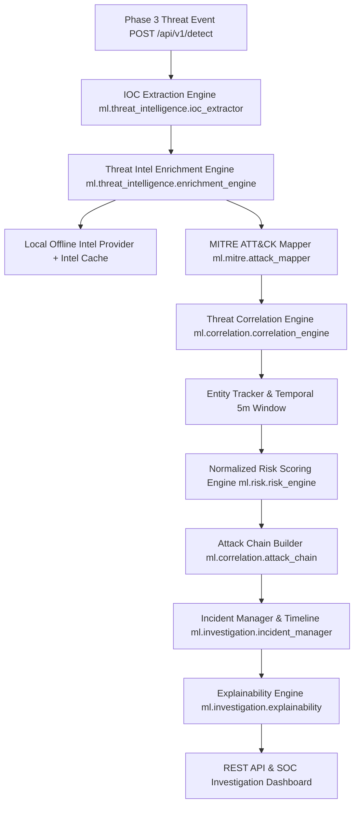

# Phase 4 — Advanced Threat Intelligence, Threat Correlation & Security Investigation Layer Technical Report

**Project:** SIH 2026 — AI-Based Cyber Threat Detection in Unidirectional IP Traffic  
**Role:** Senior Threat Intelligence Engineer & SOC Investigation Platform Developer  
**Timestamp:** 2026-09-03  

---

## 1. Executive Summary
Phase 4 transforms raw, isolated machine learning detection events from Phase 3 into enriched, correlated, risk-scored, and explainable security incidents.

Phase 3 detection logic, model artifacts (`classifier.joblib`, `anomaly_model.joblib`, `preprocessing_pipeline.joblib`, `feature_schema.json`), thresholds, and decision priority remained strictly frozen and untouched. All 26 existing Phase 1, Phase 2, and Phase 3 unit tests continue to pass alongside 9 new Phase 4 unit tests (**35/35 tests passing in 6.28s**).

---

## 2. Architecture & Data Flow



---

## 3. Existing Phase 3 Interface Consumption
Phase 4 consumes the normalized Phase 3 Threat Event structure directly:
```json
{
  "event_id": "uuid",
  "timestamp": "ISO-8601 UTC string",
  "threat_class": "DDOS / PORT_SCAN / DOS / BRUTE_FORCE / WEB_ATTACK / BOTNET / INFILTRATION / BENIGN",
  "decision": "MALICIOUS / ANOMALOUS / SUSPICIOUS / BENIGN",
  "confidence": 0.98,
  "anomaly_score": 0.8924,
  "source": {"src_ip": "10.0.0.5", "src_port": 54321},
  "destination": {"dst_ip": "10.0.0.20", "dst_port": 80},
  "alert": {"alert_id": "uuid", "severity": "HIGH", "status": "NEW"}
}
```

---

## 4. IOC Extraction Engine (`ml/threat_intelligence/ioc_extractor.py`)
- Extracts observable indicators (`IPv4`, `IPv6`, `Domain`, `URL`, `Port`, `Protocol`, `Hash`) from Phase 3 event payloads.
- Normalizes indicators (canonical IP strings, lowercase domains and hashes).
- Deduplicates indicators per event.

---

## 5. Threat Intelligence Enrichment (`ml/threat_intelligence/`)
- **Offline-First Architecture:** Default demonstration mode operates 100% offline using `data/threat_intel/` (`malicious_ips.json`, `malicious_domains.json`, `known_iocs.json`).
- **Optional External API Providers:** Supports VirusTotal, AbuseIPDB, and AlienVault OTX via environment variables (`VT_API_KEY`, `ABUSEIPDB_API_KEY`, `OTX_API_KEY`).
- **Graceful Degradation:** If API keys are missing, network calls fail, or rate limits occur, the pipeline returns `UNKNOWN` or `UNAVAILABLE` without crashing or throwing unhandled exceptions.
- **In-Memory TTL Caching:** `IntelCache` caches provider lookups to prevent redundant queries.

---

## 6. Evidence-Based MITRE ATT&CK Mapping (`ml/mitre/`)
Maps threat events to ATT&CK v14.1 techniques based on verified evidence rules:
- `PORT_SCAN` $\rightarrow$ **T1046 (Network Service Scanning)** [Discovery]
- `BRUTE_FORCE` $\rightarrow$ **T1110 (Brute Force)** [Credential Access]
- `WEB_ATTACK` $\rightarrow$ **T1190 (Exploitation of Public-Facing Application)** [Initial Access]
- `DDOS` / `DOS` $\rightarrow$ **T1498 (Network Denial of Service)** [Impact]
- `BOTNET` / `INFILTRATION`: Requires specific port/protocol evidence (e.g. port 80/443 C2); returns `NO_CONFIDENT_MAPPING` if evidence is insufficient.

Every mapping output includes: `technique_id`, `technique_name`, `tactic`, `confidence`, `reason`, `evidence`, and `mapping_basis`.

---

## 7. Threat Correlation & Entity Strength (`ml/correlation/`)
Correlates events into unified Incident clusters based on:
1. **Entity Correlation Strength Hierarchy:**
   - `EXACT_ENTITY`: Same exact Source IP (`src_ip`)
   - `STRONG`: Same Source IP + Destination IP pair
   - `MODERATE`: Same Source IP + Destination Port
   - `WEAK`: Same Subnet (`/24` IPv4 prefix)
2. **Temporal Window Correlation:** Events occurring within a configurable 5-minute (300-second) sliding window.

---

## 8. Normalized Explainable Risk Scoring (`ml/risk/risk_engine.py`)
Computes an explainable engineering risk score $[0.0, 100.0]$ by normalizing 5 core security components to $0-100$ before applying weighted summation:
$$\text{Risk Score} = \text{clip}\left(w_1 \cdot s_{\text{conf}} + w_2 \cdot s_{\text{anom}} + w_3 \cdot s_{\text{sev}} + w_4 \cdot s_{\text{intel}} + w_5 \cdot s_{\text{corr}}, 0.0, 100.0\right)$$

- **Component Normalization (0-100):**
  - `confidence_score` ($s_{\text{conf}}$): `confidence * 100` ($w_1 = 0.25$)
  - `anomaly_score` ($s_{\text{anom}}$): `anomaly_score * 100` ($w_2 = 0.20$)
  - `severity_score` ($s_{\text{sev}}$): `INFO=10`, `LOW=30`, `MEDIUM=50`, `HIGH=80`, `CRITICAL=100` ($w_3 = 0.25$)
  - `intel_score` ($s_{\text{intel}}$): `BENIGN=0`, `UNKNOWN=20`, `SUSPICIOUS=60`, `MALICIOUS=100` ($w_4 = 0.15$)
  - `correlation_score` ($s_{\text{corr}}$): `min(event_count * 25, 100)` ($w_5 = 0.15$)
- **Risk Levels:** `LOW` (0-29), `MEDIUM` (30-59), `HIGH` (60-84), `CRITICAL` (85-100).
- **Semantics Note:** Documented as an **explainable engineering default risk score** for SOC prioritization, NOT a statistical probability of compromise.

---

## 9. Attack Chain & Timeline (`ml/correlation/attack_chain.py` & `ml/investigation/timeline.py`)
- Reconstructs chronological attack progressions.
- Marks stage status explicitly: `OBSERVED`, `CORRELATED`, `INFERRED`, or `UNKNOWN`.
- Timeline entries contain timestamps, event IDs, network endpoints, threat classes, severities, risk scores, and evidence snippets.

---

## 10. Explainability Engine (`ml/investigation/explainability.py`)
Generates structured SOC investigation evidence answering:
1. *What happened?* (Correlated event count & primary threat classification)
2. *Why malicious?* (ML confidence & anomaly score evidence)
3. *Why is risk level assigned?* (Normalized component breakdown)
4. *What evidence supports the conclusion?* (Observed flow parameters & threat intel reputation)

---

## 11. REST API Endpoints (`m4_threat_classifier/api/routes.py`)
- `POST /api/v1/detect` (Preserved Phase 3 Endpoint)
- `POST /api/v1/investigations/events` (Ingests event and processes through Phase 4 pipeline)
- `GET /api/v1/incidents` (List incidents)
- `GET /api/v1/incidents/<incident_id>` (Get incident details)
- `GET /api/v1/incidents/<incident_id>/timeline` (Get incident timeline)
- `GET /api/v1/incidents/<incident_id>/attack-chain` (Get attack chain)
- `GET /api/v1/incidents/<incident_id>/mitre` (Get MITRE ATT&CK mappings)
- `GET /api/v1/iocs/<ioc_value>` (Query IOC threat intelligence reputation)
- `GET /api/v1/health` (Service health check)

---

## 12. Automated Test Verification
Executed `pytest`:
- `tests/test_detection_pipeline.py`: 10 passed
- `tests/test_feature_engineering.py`: 4 passed
- `tests/test_model_pipeline.py`: 6 passed
- `tests/test_phase4_investigation.py`: 9 passed
- `tests/test_preprocessing.py`: 6 passed
- **Total:** **35 passed in 6.28s** (0 failed, 0 skipped, 5 deprecation warnings).

---

## 13. Demonstration Scenario Results (`ml/evaluation/phase4_evaluation.py`)
Tested 4-stage attack sequence (`PORT_SCAN` $\rightarrow$ `PORT_SCAN` $\rightarrow$ `BRUTE_FORCE` $\rightarrow$ `WEB_ATTACK` from `10.0.0.5`):
- **Events Ingested:** 4 events
- **Correlated Incidents:** 1 unified incident (`inc-10-0-0-5`)
- **Calculated Risk Score:** **61.9 / 100 (HIGH)**
- **Intel Reputation:** `MALICIOUS` (APT29 Simulation in local demonstration dataset)
- **Attack Chain Progression:** 4 chronological stages (`OBSERVED` $\rightarrow$ `CORRELATED` $\rightarrow$ `CORRELATED` $\rightarrow$ `CORRELATED`)
- **Timeline & Explainability:** Successfully generated filterable timeline and SOC evidence explanations.

---

## 14. Phase 5 Recommendations
1. Integrate interactive frontend SOC Investigation Dashboard (React / Dash) visualizing incident timelines, attack chains, and MITRE matrix heatmaps.
2. Integrate LLM / Nemotron analyst explanation layer to summarize complex multi-stage incidents into natural language executive briefs.
