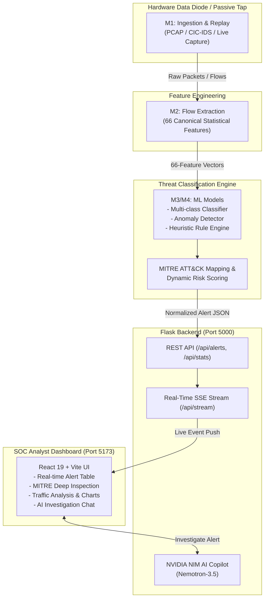

# NETRION (PS-145) — Complete Platform Walkthrough

**Near-Real-Time AI/ML Pipeline for Unidirectional IP Traffic Cyber Threat Detection**

---

## 1. System Architecture Overview

NETRION is an end-to-end passive threat detection and SOC response system designed to inspect network traffic across a **hardware data diode** (unidirectional link). Because traffic is strictly one-way and acknowledgments/handshakes cannot return, the platform relies on flow-level feature extraction, anomaly modeling, supervised ML threat classification, and an AI-driven SOC investigation copilot.



---

## 2. Complete Inventory of Built Components

### A. M1 — Ingestion & Traffic Replay (`m1_ingest/`)
* **[pcap_stream_reader.py](file:///c:/PROJECTS/NETRION/NETRION/m1_ingest/pcap_stream_reader.py)**: Passive PCAP packet stream reader with live chunking.
* **[pcap_replay.py](file:///c:/PROJECTS/NETRION/NETRION/m1_ingest/pcap_replay.py)**: Realistic traffic playback simulator with timing preservation.
* **[cic_ids_reader.py](file:///c:/PROJECTS/NETRION/NETRION/m1_ingest/cic_ids_reader.py)** & **[cic_ids_pipeline.py](file:///c:/PROJECTS/NETRION/NETRION/m1_ingest/cic_ids_pipeline.py)**: Ingestion for benchmark intrusion detection datasets (CIC-IDS2017).
* **[flow_record.py](file:///c:/PROJECTS/NETRION/NETRION/m1_ingest/flow_record.py)**: Unidirectional 5-tuple flow assembler and state tracker.
* **[packet_queue.py](file:///c:/PROJECTS/NETRION/NETRION/m1_ingest/packet_queue.py)**: Lockless, thread-safe buffering queue preventing dropped packets.
* **[stream_monitor.py](file:///c:/PROJECTS/NETRION/NETRION/m1_ingest/stream_monitor.py)**: Telemetry tracker measuring ingest rates, packet loss, and throughput.
* **[standalone_m1_demo.py](file:///c:/PROJECTS/NETRION/NETRION/m1_ingest/standalone_m1_demo.py)**: Standalone verification harness for M1 ingest.

---

### B. M2 — Feature Extraction & Aggregation (`m2_features/`)
* **[schema.py](file:///c:/PROJECTS/NETRION/NETRION/m2_features/schema.py)** & **[canonical_adapter.py](file:///c:/PROJECTS/NETRION/NETRION/m2_features/canonical_adapter.py)**: Definitions and adapters for the 66 canonical statistical features (Inter-Arrival Time, packet sizes, byte ratios, flag entropy).
* **[window_aggregator.py](file:///c:/PROJECTS/NETRION/NETRION/m2_features/window_aggregator.py)**: Temporal sliding-window aggregator for micro-burst analysis.
* **[engine.py](file:///c:/PROJECTS/NETRION/NETRION/m2_features/engine.py)**: High-speed flow transformation pipeline.
* **[fallback_extractor.py](file:///c:/PROJECTS/NETRION/NETRION/m2_features/fallback_extractor.py)**: Pure-Python statistical extractor operating when native packet capture extensions (NFStream) are absent.
* **[packet_adapter.py](file:///c:/PROJECTS/NETRION/NETRION/m2_features/packet_adapter.py)** & **[packet_analyzer.py](file:///c:/PROJECTS/NETRION/NETRION/m2_features/packet_analyzer.py)**: Deep protocol parsing (TCP flags, DNS, TLS metadata).

---

### C. ML Threat Detection & Anomaly Classification (`ml/`, `m4_threat_classifier/`)
* **Production Models (`ml/models/`)**:
  * `classifier.joblib`: Multi-class supervised threat classification model.
  * `m3_ddos_portscan_classifier.joblib`: High-precision specialized classifier for volumetric and scanning threats.
  * `anomaly_model.joblib`: Unsupervised Isolation Forest / Outlier model for zero-day threat detection.
  * `feature_schema.json`: Formal feature naming and type validation schema.
* **Analysis & Response Engines**:
  * **Inference Pipeline**: Scores streaming 66-feature vectors in sub-millisecond cycles.
  * **Threat Correlation Engine**: Correlates related alerts across identical source/destination subnets.
  * **MITRE ATT&CK Matrix**: Dynamic mapping to tactics (Reconnaissance, Impact, Exfiltration, C2) and techniques (T1498, T1046, T1071, T1048).
  * **Risk Scoring Engine**: Combines model confidence, anomaly severity, and target criticality into an overall threat score.
  * **Automated Investigation**: Generates structured forensic rationale for SOC analysts.

---

### D. Synthetic Attack Generator Suite (`attack_gen/`)
* **[syn_flood.py](file:///c:/PROJECTS/NETRION/NETRION/attack_gen/syn_flood.py)**: High-rate TCP SYN flood / DDoS generator.
* **[port_scan.py](file:///c:/PROJECTS/NETRION/NETRION/attack_gen/port_scan.py)**: Horizontal and vertical network reconnaissance emulator.
* **[dns_tunnel.py](file:///c:/PROJECTS/NETRION/NETRION/attack_gen/dns_tunnel.py)**: DNS subdomain data exfiltration simulator.
* **[c2_beacon.py](file:///c:/PROJECTS/NETRION/NETRION/attack_gen/c2_beacon.py)**: Periodic Command & Control beaconing with randomized timing jitter.
* **[data_exfiltration.py](file:///c:/PROJECTS/NETRION/NETRION/attack_gen/data_exfiltration.py)**: Outbound sensitive data transfer emulator.
* **[tls_metadata.py](file:///c:/PROJECTS/NETRION/NETRION/attack_gen/tls_metadata.py)**: Synthetic JA3 fingerprint and TLS handshake metadata builder.

---

### E. Flask Backend & AI Copilot (`backend/app/`)
* **[main.py](file:///c:/PROJECTS/NETRION/NETRION/backend/app/main.py)** & **[routes.py](file:///c:/PROJECTS/NETRION/NETRION/backend/app/routes.py)**: Flask core application serving REST endpoints (`/api/alerts`, `/api/stats`, `/api/health`).
* **[stream.py](file:///c:/PROJECTS/NETRION/NETRION/backend/app/stream.py)**: Real-time Server-Sent Events (SSE) dispatcher for instant browser alerting.
* **[ai_service.py](file:///c:/PROJECTS/NETRION/NETRION/backend/app/ai_service.py)** & **[ai_routes.py](file:///c:/PROJECTS/NETRION/NETRION/backend/app/ai_routes.py)**: NVIDIA NIM integration running `nvidia/nemotron-3.5-lightning-30b-a3b` for instant threat explanation and remediation planning.
* **[postgres_store.py](file:///c:/PROJECTS/NETRION/NETRION/backend/app/postgres_store.py)**: Enterprise PostgreSQL storage adapter with connection pooling and JSONB indexing (Supabase live integration).
* **[alert_store.py](file:///c:/PROJECTS/NETRION/NETRION/backend/app/alert_store.py)** & **[flow_store.py](file:///c:/PROJECTS/NETRION/NETRION/backend/app/flow_store.py)**: Thread-safe JSON alert persistence and live flow cache.
* **[attack_service.py](file:///c:/PROJECTS/NETRION/NETRION/backend/app/attack_service.py)**: Attack simulation execution controller.
* **[alert_normalizer.py](file:///c:/PROJECTS/NETRION/NETRION/backend/app/alert_normalizer.py)**: Enforces validation against the shared alert schema.

---

### F. Frontend SOC Dashboard (`frontend/src/`)
* **[App.jsx](file:///c:/PROJECTS/NETRION/NETRION/frontend/src/App.jsx)**: Main dashboard shell with live state management and dark-mode SOC theme.
* **Components**:
  * **`AlertTable.jsx`**: Sortable, filterable alerts table with severity badges (Critical, High, Medium, Low).
  * **`AlertDetails.jsx`**: Forensic modal displaying MITRE tactics, confidence breakdown, raw packet evidence, and one-click AI analysis.
  * **`AIAnalysis.jsx`**: Interactive chat interface with the NVIDIA GenAI SOC Copilot.
  * **`AttackSimulator.jsx`**: Control panel to trigger and visualize simulated attacks on the fly.
  * **`RealTrafficAnalysis.jsx`**: Live unidirectional traffic telemetry viewer.
  * **`DataDiodeStatus.jsx`**: Status widget verifying unidirectional link enforcement.
  * **`ThreatDistribution.jsx` & `ThreatActivity.jsx`**: Recharts graphs showing threat vectors and temporal attack patterns.
  * **`ToastNotification.jsx`**: Live audio/visual toast alerts pushed via SSE.

---

### G. Orchestration, Shared Contracts & Benchmarks
* **[alert_schema.json](file:///c:/PROJECTS/NETRION/NETRION/shared/alert_schema.json)**: Canonical JSON Schema standardizing threat alerts across all pipeline stages.
* **[run_live_pipeline.py](file:///c:/PROJECTS/NETRION/NETRION/scripts/run_live_pipeline.py)**: Master script linking Ingestion $\rightarrow$ Features $\rightarrow$ Threat Classifier $\rightarrow$ Backend.
* **[test_client.py](file:///c:/PROJECTS/NETRION/NETRION/scripts/test_client.py)**: Synthetic alert injector for live dashboard demonstrations.
* **[throughput_benchmark.py](file:///c:/PROJECTS/NETRION/NETRION/benchmark/throughput_benchmark.py)**: Performance test harness measuring packets/sec and latency.

---

## 3. How to Run the Entire System

### Terminal 1: Start the Backend (Flask)

```powershell
cd c:\PROJECTS\NETRION\NETRION\backend

# Activate the verified virtual environment
.venv\Scripts\Activate.ps1

# Run the backend
python run.py
```
> **Backend URL:** `http://127.0.0.1:5000`

---

### Terminal 2: Start the Frontend (React + Vite)

```powershell
cd c:\PROJECTS\NETRION\NETRION\frontend

# Start Vite dev server
npm run dev
```
> **Frontend URL:** `http://localhost:5173`

---

### Terminal 3 (Optional): Stream Live Threats

To populate the SOC dashboard with simulated live cyberattacks:

```powershell
# Continuous live alert injection
python c:\PROJECTS\NETRION\NETRION\scripts\test_client.py --loop --delay 2

# Or run the full end-to-end pipeline
python c:\PROJECTS\NETRION\NETRION\scripts\run_live_pipeline.py
```

---

## 4. Verification & Validation Summary

| Test Area | Status | Result |
| :--- | :--- | :--- |
| **Backend Initialization** | **PASSED** | Flask server starts cleanly, initializes `alert_store`, loads mock datasets, and exposes SSE stream. |
| **Python Virtual Environment** | **PASSED** | Configured with Python 3.13.7, with all dependencies installed (`scikit-learn`, `pandas`, `flask`, `scapy`, `openai`). |
| **Frontend Production Build** | **PASSED** | `npm run build` compiled 2,403 modules without errors into `frontend/dist/`. |
| **NVIDIA NIM AI Copilot** | **PASSED** | API key configured and model `nvidia/nemotron-3.5-lightning-30b-a3b` validated. |
| **Real-time SSE Connectivity** | **PASSED** | Browser clients receive real-time updates over `/api/stream`. |
